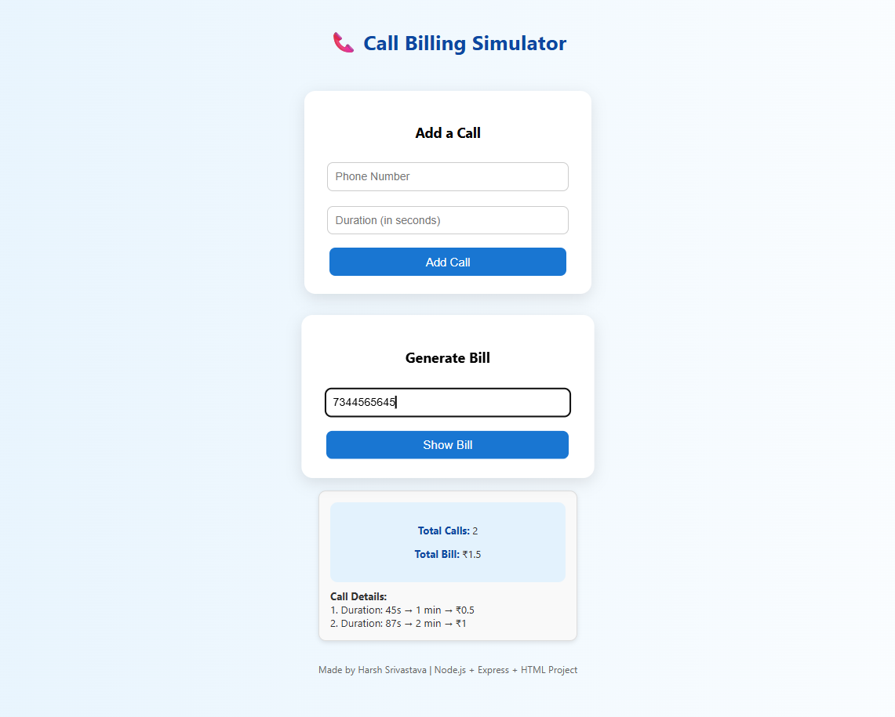

#  Call Billing Simulator



A simple Node.js + Express web app that simulates call billing based on call duration.  
Users can add call records and instantly generate bills with detailed breakdowns.

---

##  Features
- Add call records (number + duration)
- Generate detailed call bills instantly
- Calculate charges at ₹0.50 per minute (rounded up)
- Built with plain HTML, CSS, and JavaScript (no frameworks)

---

##  Tech Stack
- **Frontend:** HTML, CSS, Vanilla JavaScript  
- **Backend:** Node.js, Express.js  
- **Tools:** VS Code, Git, Postman/Hoppscotch

---

##  Run Locally
Clone the project

```bash
git clone https://github.com/Harshri2212/call-billing-simulator.git


